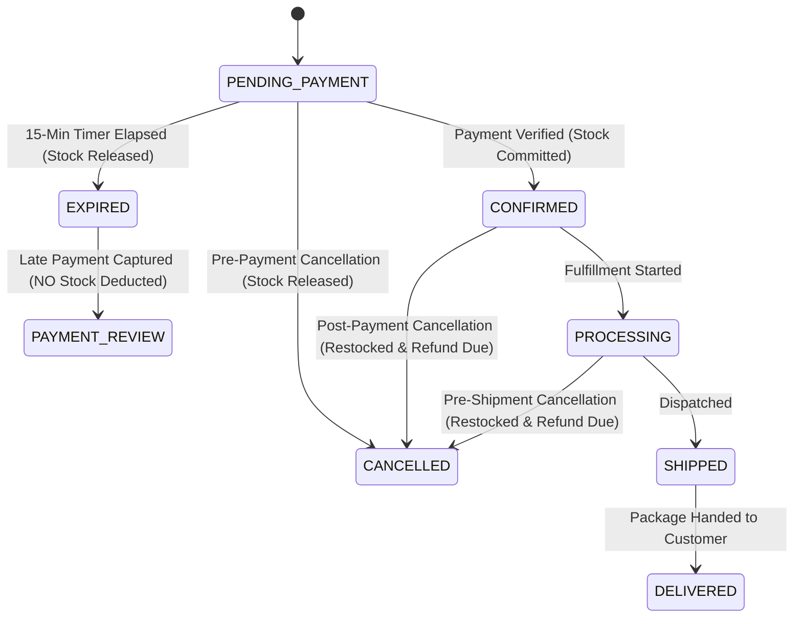
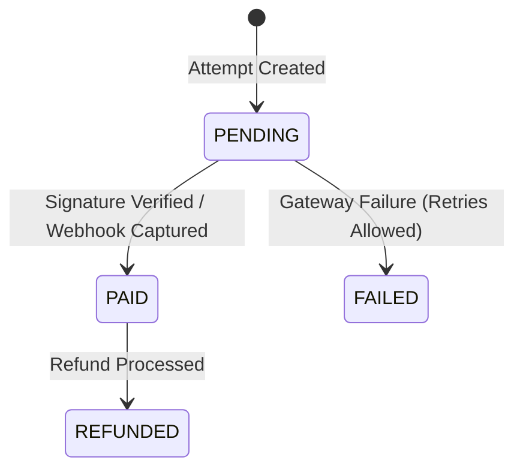
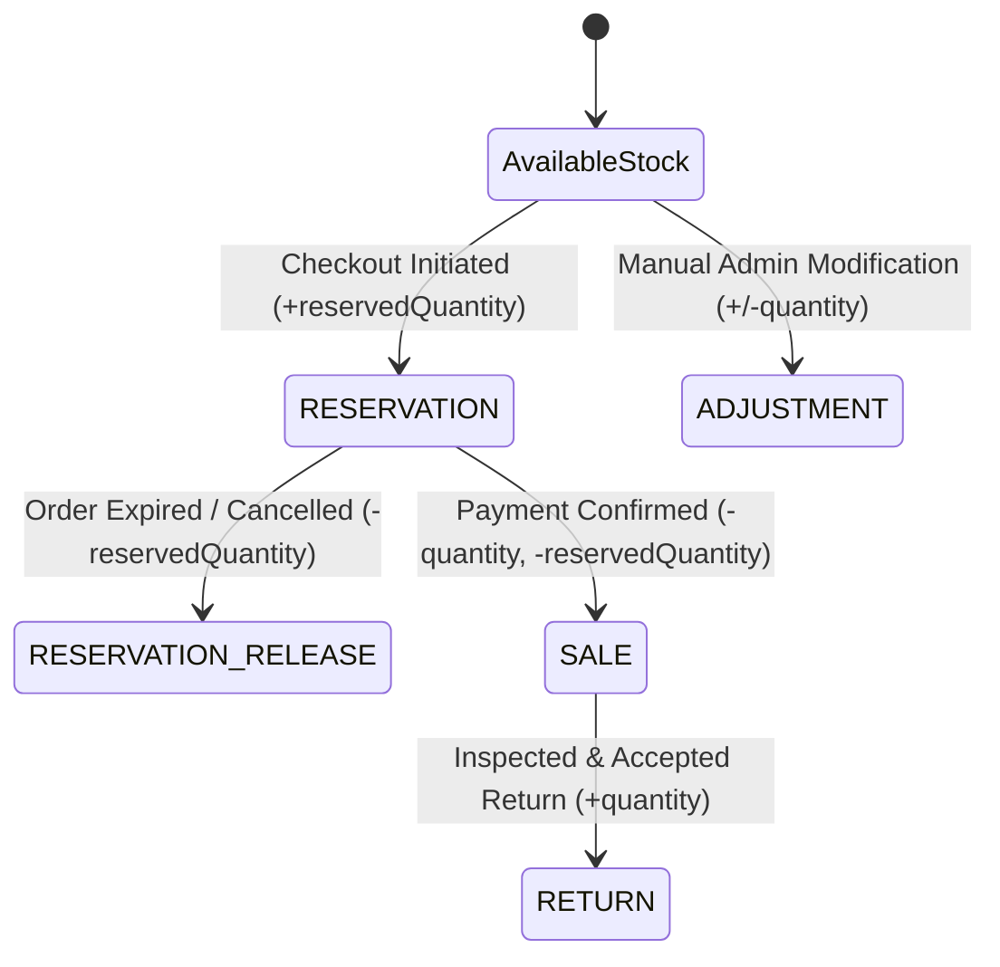
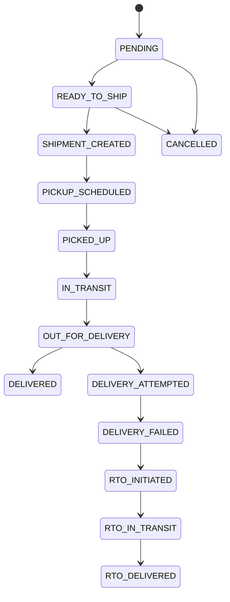

# Ahankara Boutique — Project Knowledge Base & System Architecture

**Document Version:** 2.0.0  
**Generated On:** 2026-09-01  
**Target Platform:** Next.js 16 (Turbopack) | PostgreSQL | Prisma 7  
**Scope:** Versions 1 through 12 Backend Infrastructure & Transition Analysis

---

## 1. Project Overview
Ahankara Boutique is an artisanal, luxury fashion e-commerce platform. The project has undergone 12 comprehensive iterative engineering phases (Versions 1 through 12) focusing exclusively on establishing an enterprise-grade, highly resilient backend foundation. 

The application architecture enforces strict domain boundaries, transactional atomicity, provider-neutral logistics abstraction, immutable snapshot audit trails, and mathematically verifiable inventory and financial state machines. All customer-facing and administrative user interfaces have been intentionally deferred to subsequent frontend development milestones.

---

## 2. Complete Technology Stack

| Category | Technology | Declared Version | Installed / Runtime Version |
| :--- | :--- | :--- | :--- |
| **Framework** | Next.js (App Router) | `16.2.10` | `16.2.10` (Turbopack) |
| **Language** | TypeScript | `^5` | `5.9.3` |
| **Runtime** | Node.js | `>= 18.17.0` | `v24.18.0` |
| **Package Manager** | npm | `>= 9` | `11.16.0` |
| **Core UI Library** | React / React DOM | `19.2.4` | `19.2.4` |
| **Database** | PostgreSQL | `>= 14` | PostgreSQL 16+ (Fedora service active) |
| **Database Driver** | `pg` / `@types/pg` | `^8.22.0` / `^8.20.0` | `8.22.0` / `8.20.0` |
| **ORM** | Prisma | `^7.9.0` | `7.9.0` |
| **Prisma Adapter** | `@prisma/adapter-pg` | `^7.9.0` | `7.9.0` |
| **Authentication** | Better Auth | `^1.6.24` | `1.6.24` (with `emailOTP` plugin) |
| **Validation** | Zod | `^4.4.3` | `4.4.3` |
| **Email Delivery** | Resend | `^6.18.0` | `6.18.0` |
| **Media Storage** | Cloudinary | `^2.10.0` | `2.10.0` |
| **Payment Gateway** | Razorpay Node SDK | `^2.9.8` | `2.9.8` |
| **Shipping Logistics** | Custom Provider Adapter | Architecture | Provider-neutral (`Mock`, `Shiprocket`) |
| **Styling** | Tailwind CSS / PostCSS | `^4` / `^4` | `4.3.3` (`@tailwindcss/postcss`) |
| **Linting** | ESLint | `^9` | `9.39.5` (`eslint-config-next` `16.2.10`) |
| **TypeScript Execution**| tsx / ts-node | `^4.23.1` / `^10.9.2` | `4.23.1` / `10.9.2` |

---

## 3. Repository Structure

```
ahankara-boutique/
├── .agents/                    # Antigravity agent configuration & Prisma skill rules
├── .claude/                    # Claude skill reference symlinks
├── .env                        # Local environment credentials (protected by .gitignore)
├── .gitignore                  # Git ignore rules (protects .env*, node_modules, .next)
├── AGENTS.md                   # Critical agent operational rules (Next.js breaking changes)
├── CLAUDE.md                   # Claude agent pointer
├── eslint.config.mjs           # ESLint 9 configuration with Next.js core web vitals
├── next.config.ts              # Next.js compiler & server configuration
├── package.json                # Project manifest and scripts
├── package-lock.json           # Deterministic dependency lockfile
├── postcss.config.mjs          # PostCSS configuration for Tailwind v4
├── prisma/
│   ├── migrations/             # 15 chronological SQL migrations (V1 to V12)
│   ├── prisma.config.ts        # Prisma 7 configuration file
│   └── schema.prisma           # Complete database schema (23 models, 13 enums)
├── public/                     # Static public assets & test checkout artifacts
│   └── test-checkout.html      # Razorpay payment verification test harness
├── reports/                    # Historical verification reports (V1 to V12)
├── scratch/                    # Test harnesses and diagnostic scripts
├── src/
│   ├── app/                    # Next.js App Router root
│   │   ├── api/                # 56 API Route Handlers
│   │   │   ├── admin/          # Secured admin management routes (products, orders, etc.)
│   │   │   ├── auth/           # Better Auth [...all] handler
│   │   │   ├── categories/     # Public category taxonomy routes
│   │   │   ├── collections/    # Public collection curation routes
│   │   │   ├── health/         # System health & database connection route
│   │   │   ├── me/             # Customer authenticated domain routes (cart, orders, etc.)
│   │   │   ├── products/       # Public product catalogue routes
│   │   │   └── webhooks/       # Razorpay webhook listener
│   │   ├── favicon.ico         # Application favicon
│   │   ├── globals.css         # Global Tailwind CSS imports
│   │   ├── layout.tsx          # Root HTML layout wrapper
│   │   └── page.tsx            # Temporary backend status placeholder
│   ├── lib/
│   │   ├── auth.ts             # Better Auth server initialization & adapter
│   │   └── prisma.ts           # PrismaClient initialization with pg pool adapter
│   ├── server/
│   │   ├── services/           # 23 Core business logic and external service modules
│   │   │   └── shipping/       # Shipping provider interface and provider implementations
│   │   └── validators/         # 15 Zod schema validation files
│   └── utils/
│       ├── api-response.ts     # Standardized JSON response formatting
│       ├── env.ts              # Zod environment variable parsing & validation
│       ├── error-handler.ts    # Global HTTP error translation layer
│       ├── errors.ts           # Domain-specific AppError hierarchy
│       ├── logger.ts           # Structured logging utility
│       ├── rate-limit.ts       # In-memory sliding window rate limiter
│       └── slug.ts             # Deterministic URL slug generator
└── tsconfig.json               # TypeScript compiler options (strict mode)
```

---

## 4. Frontend Architecture
- **Current Status:** `PENDING` / `MINIMAL FOUNDATION`
- **Existing Implementation:**
  - `src/app/layout.tsx`: Root HTML layout with font imports.
  - `src/app/page.tsx`: Static backend placeholder ("Ahankara Boutique E-Commerce API - Backend Version 1 is running.").
  - `public/test-checkout.html`: Standalone browser test harness for manual Razorpay checkout validation.
- **Unimplemented Frontend Surfaces:**
  1. Customer Storefront (Home, Category landing, Product listing with filters).
  2. Product Details Page (PDP) with real-time variant availability, image carousel, size charts.
  3. Interactive Cart Drawer / Cart Page.
  4. Multi-step Checkout (Address selector, Coupon input, Order review, Razorpay checkout modal).
  5. Customer Account Portal (Order history, Live package tracking, Returns/Exchanges initiation, Saved addresses).
  6. Admin Management Dashboard (Catalog management, Variant inventory controls, Shipment dispatch, Return inspections, Coupon creation).
  7. Client-side global state store (Zustand / TanStack Query).

---

## 5. Backend Architecture
- **Current Status:** `COMPLETED` (for Versions 1 through 12 capabilities)
- **Architecture Pattern:** Layered Service-Oriented Architecture (Route Handler → Validator → Service → Repository/Prisma).
- **Key Modules:**
  - **Routing:** Built exclusively using Next.js 16 App Router Route Handlers (`route.ts`).
  - **Input Validation:** Every payload, query string, and route parameter is parsed through strict Zod validators in `src/server/validators/`.
  - **Service Layer:** Encapsulates all transactional logic in `src/server/services/`. Cross-service coordination is executed through explicit transactional clients (`txClient`).
  - **Error Handling:** Centralized through `handleError` in `src/utils/error-handler.ts`, converting domain exceptions (`NotFoundError`, `ConflictError`, `ValidationError`, `UnauthorizedError`, `ForbiddenError`) into standardized RFC-compliant JSON errors.
  - **Rate Limiting:** Sliding-window rate limiter protecting sensitive authentication endpoints.

---

## 6. Database Architecture
- **Current Status:** `COMPLETED`
- **Database Engine:** PostgreSQL (with connection pooling via `pg.Pool`).
- **ORM:** Prisma 7 (`@prisma/client` with `@prisma/adapter-pg`).
- **Prisma Models (23 Total):**
  - **Core & Auth:** `SystemHealth`, `User`, `Session`, `Account`, `Verification`, `Address`.
  - **Catalog:** `Category`, `Collection`, `Product`, `ProductCollection`, `ProductImage`, `ProductVariant`.
  - **Inventory:** `Inventory`, `InventoryTransaction`.
  - **Commerce:** `Cart`, `CartItem`, `WishlistItem`, `Order`, `OrderAddress`, `OrderItem`.
  - **Payments & Promotions:** `Payment`, `PaymentWebhookEvent`, `Coupon`, `CouponProduct`, `CouponCategory`, `CouponCollection`, `CouponRedemption`.
  - **Fulfillment:** `Shipment`, `ShipmentItem`, `ShipmentTrackingEvent`.
  - **Post-Purchase:** `OrderCancellation`, `ReturnRequest`, `ReturnItem`, `ExchangeRequest`, `ExchangeItem`, `Refund`.
- **Database Enums (13 Total):**
  `UserRole`, `UserStatus`, `CouponType`, `AddressType`, `ProductStatus`, `OrderStatus`, `PaymentStatus`, `FulfillmentStatus`, `ShippingProvider`, `ShipmentStatus`, `InventoryTransactionType`, `CancellationInitiator`, `CancellationStatus`, `ReturnStatus`, `ReturnReason`, `ExchangeStatus`, `RefundStatus`.
- **Key Architectural Constraints:**
  - **Paise Minor Units:** All monetary figures are stored as integer paise to completely eliminate floating-point rounding errors.
  - **Immutable Snapshots:** `OrderAddress` snapshots addresses at checkout; `OrderItem` snapshots names, prices, SKUs, and options, ensuring historical audit purity.
  - **Strict Referential Integrity:** Foreign keys enforce strict cascades and set-null constraints to prevent orphaned operational records.

---

## 7. Authentication Architecture
- **Current Status:** `COMPLETED`
- **Framework:** **Better Auth** (`better-auth`) integrated with PostgreSQL via Prisma adapter.
- **Session Model:** Server-validated sessions via HTTP cookies and headers.
- **Verification Flow:** 6-digit OTP delivery via Resend with a 10-minute time-to-live. Single-use enforcement.
- **Authorization Levels:**
  - `CUSTOMER`: Default public signup role. Locked to self-owned `/api/me/*` resources.
  - `ADMIN`: Required for `/api/admin/*`. Provisioned strictly through controlled server-side seeding (`AuthService.seedAdminUser`). No public admin signup exists.
- **Account State Controls:** `ACTIVE`, `SUSPENDED` (blocked with 403), `DEACTIVATED` (blocked with 403).

---

## 8. Payment Architecture (Razorpay)
- **Current Status:** `COMPLETED` (Verified in Razorpay Test Mode)
- **Gateway Integration:** Official `razorpay` Node.js SDK.
- **Cryptographic Verification:**
  - Checkout response verification: HMAC-SHA256 signature calculated over `${order_id}|${payment_id}` using `RAZORPAY_KEY_SECRET`.
  - Webhook verification: HMAC-SHA256 calculated over raw request body using `RAZORPAY_WEBHOOK_SECRET`.
- **Dual-Ingestion Reconciliation:** Synchronous frontend verification (`/api/me/orders/[orderId]/payment/verify`) and asynchronous webhooks (`/api/webhooks/razorpay`) route into the identical idempotent finalizer: `PaymentService.finalizeSuccessfulPayment`.
- **State Transition Workflows:**
  - **Normal Successful Payment:**
    1. Order status is `PENDING_PAYMENT` with active reservation.
    2. Signature verified.
    3. Exactly-once inventory commitment (`InventoryService.commitStock`).
    4. Stock decremented (`quantity` and `reservedQuantity`).
    5. Audit log written (`InventoryTransactionType.SALE`).
    6. Coupon redemption recorded with atomic `SELECT ... FOR UPDATE` usage limit locking.
    7. Purchased items selectively purged from customer's active cart.
    8. `Order.status = CONFIRMED`, `Payment.status = PAID`.
  - **Late Payment (After Expiration):**
    1. Order status is `EXPIRED` or `CANCELLED` (reservation previously released).
    2. Payment captured on gateway.
    3. `Payment.status = PAID`.
    4. `Order.status = PAYMENT_REVIEW`, `Order.paymentStatus = PAID`.
    5. **ZERO stock deduction.**
    6. **ZERO reservation recreation.**
    7. **ZERO cart cleanup.**
    8. Flags transaction for administrative intervention.
  - **Coupon Over-Redemption Race Protection:**
    If a coupon reaches max usage while payment was in-flight, order transitions safely to `PAYMENT_REVIEW` to safeguard captured funds without data corruption.

---

## 9. Inventory Architecture
- **Current Status:** `COMPLETED`
- **Stock Fields:** `quantity` (physical on-hand) and `reservedQuantity` (temporary lock during checkout).
- **Available Stock Formula:** `quantity - reservedQuantity`.
- **Concurrency & Race Elimination:** Atomic raw SQL operations (`tx.$queryRaw`) with conditional updates:
  ```sql
  UPDATE "inventories"
  SET "reservedQuantity" = "reservedQuantity" + $quantity, "updatedAt" = NOW()
  WHERE "id" = $inventoryId AND "quantity" - "reservedQuantity" >= $quantity
  RETURNING "quantity", "reservedQuantity";
  ```
- **Lifecycle Operations:**
  - `reserveStock`: Locks stock during checkout creation (15-minute reservation).
  - `releaseStock`: Frees locked stock upon order expiration or pre-payment cancellation.
  - `commitStock`: Deducts physical quantity and releases reservation upon successful payment.
  - `adjustStock`: Administrative manual adjustment with negative stock guards.
- **Audit Trail:** Immutable `InventoryTransaction` records for every state change.

---

## 10. Shipping Architecture
- **Current Status:** `COMPLETED` (Provider-neutral core)
- **Design Pattern:** Strategy / Adapter pattern via `ShippingProviderAdapter`.
- **Supported Providers:** `MOCK`, `SHIPROCKET`, `DELHIVERY`, `MANUAL`.
- **Core Entities:**
  - `Shipment`: Supports partial, split, and multi-package fulfillment per order.
  - `ShipmentItem`: Tracks fulfilled quantities against specific `OrderItem` IDs.
  - `ShipmentTrackingEvent`: Append-only, chronological tracking event history with event deduplication.
- **Integrity Rules:**
  - Shipments are built strictly against immutable `OrderAddress` snapshots.
  - Monotonic status progression: prevents retrograde status rollbacks (e.g. `DELIVERED` back to `IN_TRANSIT`).
  - Automatic order fulfillment status synchronization (`UNFULFILLED` -> `PARTIALLY_FULFILLED` -> `FULFILLED` -> `DELIVERED`).

---

## 11. Shiprocket Architecture
- **Current Status:** `IN PROGRESS` / `DEFERRED LIVE RUN`
- **Implementation File:** `src/server/services/shipping/providers/shiprocket.provider.ts`.
- **Authentication:** In-memory JWT token acquisition against Shiprocket external API with a 9-day caching policy.
- **Operations Implemented:**
  - Order creation (`/orders/create/adhoc`) mapping boutique items, weights, and addresses.
  - Provider shipment ID capture, AWB code assignment, courier name assignment.
- **Live KYC Status:** KYC is currently being processed by the client's authorized relative. All post-KYC live shipment mutations are deferred.

---

## 12. Resend Architecture
- **Current Status:** `COMPLETED`
- **Implementation File:** `src/server/services/email.service.ts`.
- **Boutique Identity:** `ahankarastudios@gmail.com` / `AUTH_EMAIL_FROM`.
- **Features:**
  - Transactional authentication OTP delivery for Better Auth.
  - Branded responsive HTML email layout.
  - Development mock fallback when API key is unconfigured.
  - Zero OTP logging: verification secrets are strictly kept out of application logs.

---

## 13. Cloudinary Architecture
- **Current Status:** `COMPLETED`
- **Implementation File:** `src/server/services/cloudinary.service.ts`.
- **Features:**
  - Direct server-side buffer streaming into scoped folders (`ahankara/products/{productId}`).
  - Allowed image mime types: `jpg`, `png`, `jpeg`, `webp`.
  - Image deletion by public ID (`cloudinary.uploader.destroy`).
  - Transactional primary image switching and gallery ordering (`ProductImageService`).

---

## 14. Environment Variable Inventory

> [!IMPORTANT]
> The following list contains environment variable **names only**. No values, credentials, or secrets are exposed.

| Variable Name | Category | Sensitivity | Requirement Status |
| :--- | :--- | :--- | :--- |
| `DATABASE_URL` | Database | High (Contains DB credentials) | **Required** (PostgreSQL connection string) |
| `NODE_ENV` | Runtime | Low | Optional (Defaults to `development`) |
| `BETTER_AUTH_SECRET` | Authentication | High (Session signing key) | Required (Has code default for dev) |
| `BETTER_AUTH_URL` | Authentication | Low (App base URL) | Required (Defaults to `http://localhost:3000`) |
| `RESEND_API_KEY` | Email | High (Mail API credential) | Optional in dev (Mock fallback enabled) |
| `AUTH_EMAIL_FROM` | Email | Low (Sender address) | Optional (Defaults to configured sender) |
| `CLOUDINARY_CLOUD_NAME` | Media | Medium | Required for live media operations |
| `CLOUDINARY_API_KEY` | Media | Medium | Required for live media operations |
| `CLOUDINARY_API_SECRET` | Media | High | Required for live media operations |
| `RAZORPAY_KEY_ID` | Payment | Medium (Public key) | Required for payment creation |
| `RAZORPAY_KEY_SECRET` | Payment | High (Secret key) | Required for payment signature verification |
| `RAZORPAY_WEBHOOK_SECRET`| Payment | High (Webhook HMAC key) | Required for webhook authentication |
| `SHIPROCKET_EMAIL` | Shipping | High (Account credential) | Required for live Shiprocket operations |
| `SHIPROCKET_PASSWORD` | Shipping | High (Account credential) | Required for live Shiprocket operations |
| `SHIPROCKET_PICKUP_LOCATION`| Shipping | Low | Optional (Defaults to `'Primary'`) |

---

## 15. Security Model
1. **Zero Client Trust:** Identity is always derived from server-verified sessions via HTTP headers, never from client-supplied IDs.
2. **Strict Admin Boundaries:** All catalog mutations, manual inventory adjustments, coupon creations, and shipment fulfillments are locked behind `requireRole(UserRole.ADMIN)`.
3. **Customer Data Isolation:** Customers can only read and mutate their own cart, orders, addresses, and return requests.
4. **Cryptographic Webhooks:** All incoming Razorpay webhooks require raw-body HMAC-SHA256 signature verification before processing.
5. **No Plaintext Passwords or Tokens:** Managed via Better Auth with robust hashing algorithms.

---

## 16. Idempotency Model
1. **Order Creation:** Protected by compound unique index `[userId, idempotencyKey]`.
2. **Payment Attempts:** Reuses existing `PENDING` payment attempt records for an order.
3. **Payment Finalization:** Atomic check-and-set inside Prisma transaction; duplicate calls return early without double-committing stock.
4. **Webhooks:** `PaymentWebhookEvent` table tracks processed provider event IDs, rejecting replays.
5. **Coupon Redemption:** Atomically verified and recorded per order; duplicate redemptions rejected.
6. **Refunds:** Protected by unique `idempotencyKey` on the `Refund` model.

---

## 17. Order State Machine



---

## 18. Payment State Machine



---

## 19. Inventory State Machine



---

## 20. Shipment State Machine



---

## 21. Existing Test Coverage
- **Status:** `COMPLETED (Manual & Scripted)` / `PENDING (Automated CI Suite)`
- **Automated Framework:** No Jest/Vitest configuration currently present in `package.json`.
- **Diagnostic Scripts:**
  - `scratch/verify-step9-late-payment.ts`: Comprehensive verification of late payment capture, `PAYMENT_REVIEW` status, zero stock deduction, and idempotency replays.
  - `scratch/prepare-late-payment-test.ts`: Controlled setup for simulating expired checkouts.
- **Historical Reports:** 15 detailed verification reports in `reports/` verifying Versions 1 through 12.
- **Static Quality Gates:** TypeScript strict compilation (`tsc`) and ESLint 9 are active.

---

## 22. Existing Verification Reports
Found 15 historical reports in `reports/`:
- `v1-completion-report.md`: Core Next.js & Prisma foundation.
- `v2-completion-report.md` & `v2-runtime-report.md`: User & Address domain models.
- `v3-completion-report.md`: Better Auth & Resend integration.
- `v4-completion-report.md`: Category hierarchies & Collections taxonomy.
- `v5-completion-report.md`: Product catalog & Cloudinary media integration.
- `v6-completion-report.md`: Product variants & atomic raw SQL inventory engine.
- `v7-completion-report.md`: Cart & Wishlist architecture.
- `v8-completion-report.md`: Checkout, stock reservation & order foundation.
- `v9-completion-report.md` & `v9-final-razorpay-verification-report.md`: Razorpay payment integration & webhook idempotency.
- `v10-completion-report.md`: Coupons & pricing engine.
- `v11-completion-report.md`: Provider-neutral shipping & tracking architecture.
- `v12-completion-report.md`: Order cancellations, returns, exchanges & coupon-aware refunds.
- `ANTIGRAVITY_PROJECT_KNOWLEDGE_BASE.md`: Repository onboarding knowledge base.

---

## 23. Current Implementation Status
- **Backend Architecture:** `COMPLETED`
- **Database Schema & Migrations:** `COMPLETED` (15 migrations up to date)
- **Authentication & Security:** `COMPLETED`
- **Payment Engine (Razorpay):** `COMPLETED` (Test mode verified, live operations pending deployment)
- **Inventory Engine:** `COMPLETED`
- **Shipping Abstraction:** `COMPLETED`
- **Shiprocket Provider:** `IN PROGRESS` (Live operations blocked pending client KYC)
- **Resend Email:** `COMPLETED`
- **Cloudinary Media:** `COMPLETED`
- **Frontend UI:** `PENDING`

---

## 24. Known Pending Tasks
1. **Frontend Development:**
   - Design and assemble customer storefront UI (Tailwind CSS v4).
   - Implement Product Catalog, Filtering, and Product Details Page (PDP).
   - Implement Cart Drawer and Multi-Step Checkout UI.
   - Implement Customer Account Portal (Order History, Returns, Addresses).
   - Implement Admin Management Portal.
2. **Database Role Configuration:**
   - Synchronize local PostgreSQL user credentials with `.env` `DATABASE_URL`.
3. **Automated Testing Suite:**
   - Configure Vitest or Jest for regression testing.
4. **Logistics KYC:**
   - Complete Shiprocket KYC and verify live courier scheduling.

---

## 25. Current Development Environment Status
- **Operating System:** Linux (Fedora)
- **Node.js Version:** `v24.18.0`
- **npm Version:** `11.16.0`
- **Git Branch:** `main` (Clean working tree, origin in sync)
- **Local PostgreSQL:** Active systemd service (`active (running)`). Database connection authentication currently pending credential synchronization.

---

## 26. Dependency Status
- **Status:** `COMPLETED`
- All dependencies declared in `package.json` are installed and verified in `node_modules` matching `package-lock.json`. Zero missing packages.

---

## 27. Build & Lint Status
- **ESLint (`npm run lint`):** `PASS` (0 errors, 17 unused-variable warnings).
- **Prisma Generation (`npx prisma generate`):** `PASS` (Generated Prisma Client v7.9.0).
- **Next.js Production Build (`npm run build`):** `PASS` (Turbopack compiled 56 routes successfully with 0 errors).

---

## 28. Risks or Inconsistencies Discovered
1. **Database Authentication Synchronization:** Running database queries against the local PostgreSQL instance returned `password authentication failed for user "ediith"`. The PostgreSQL service is active, but the database user/password configured in `DATABASE_URL` needs alignment in the local environment.
2. **Missing Customer Frontend:** The platform has a complete backend API, but zero user-facing pages, requiring frontend construction.
3. **Unused Variable Warnings:** 17 minor ESLint warnings exist across 8 service and validator files. These are non-fatal, but should be addressed during code polish.
4. **Shiprocket Post-KYC Dependency:** Live fulfillment is dependent on external KYC completion by the client.
